# Arquitectura de RISKO y Portal RISKO

Este diagrama representa la arquitectura vigente del cálculo y publicación de
Position Monitor, la biblioteca productiva de dashboards y la ejecución local
de Portal RISKO. Las flechas continuas muestran datos o invocaciones; las
discontinuas representan lectura, control, actualización o trazabilidad.

**Exportaciones:** [Word con los dos diagramas](ARQUITECTURA_RISKO_PORTAL.docx) ·
[SVG de arquitectura](diagramas/arquitectura_risko_portal.svg) ·
[SVG de cierre e intradía](diagramas/flujos_publicacion_risko.svg)

```mermaid
flowchart LR
    classDef actor fill:#0F3D5E,color:#FFFFFF,stroke:#08283F,stroke-width:2px
    classDef source fill:#E8F1F7,color:#15364B,stroke:#5A829A
    classDef app fill:#E8F7F2,color:#123B31,stroke:#23866F,stroke-width:1.5px
    classDef process fill:#FFF6DF,color:#4A3500,stroke:#D19B24
    classDef data fill:#F4ECFA,color:#44245B,stroke:#8B5BA5
    classDef portal fill:#EAF0FF,color:#18315F,stroke:#5A78BD,stroke-width:1.5px
    classDef local fill:#F7F7F8,color:#30343B,stroke:#777E89
    classDef note fill:#FFF1F0,color:#68231E,stroke:#CE665D,stroke-dasharray: 5 4

    subgraph EXT["Fuentes y actores corporativos"]
        direction TB
        OP["Operador de Riesgo<br/>fecha · cierre · intradía"]:::actor
        SUMMIT["Summit y reportes oficiales<br/>Spot · Novados · Forward<br/>Opciones · Swaps · Títulos"]:::source
        MARKET["Datos de mercado<br/>TRM · SETFX · curvas<br/>superficies y parámetros"]:::source
        CONSUMER["Usuario consumidor<br/>Riesgo / Tesorería"]:::actor
    end

    subgraph PROJECT["Proyecto Risko · red de desarrollo y operación"]
        direction TB
        subgraph RISKO["Aplicación RISKO"]
            direction TB
            UI["interfaz_risko.py<br/>controles, fecha y log"]:::app
            SERVICE["servicios/position_monitor.py<br/>orquestación y reglas de publicación"]:::app
            VECTOR["Herramientas/VECTOR/VECTOR.py<br/>flujos de carga"]:::process
            INPUTS["datos/insumos<br/>staging local de archivos"]:::data
            CONFIG["configuración<br/>risko.json · param_*.csv<br/>dashboard_publicacion.json"]:::data
            CORE["compartido/nucleo_risko<br/>rutas · fechas · archivos · SQLite"]:::app
            MODULES["procesos por producto<br/>Spot · Novados · Forward<br/>Opciones · Swaps · Renta Fija"]:::process
            DB[("risko.db<br/>tablas por producto<br/>actual · consolidada · histórico")]:::data
            AUX[("risko_auxiliar.db<br/>soportes e intermedios")]:::data
            CONSOL["consolidación.py<br/>homologa · reemplaza fecha<br/>excluye IFRS publicable"]:::process
            INTRA["Ruta intradía aislada<br/>solo Banking · SETFX<br/>no altera tablas oficiales"]:::process
            INTRADB[("risko_intradia.db<br/>clon/ancla Spot y soportes")]:::data
            DASHY["panel_position_monitor.py<br/>+ Herramientas/dashy<br/>construcción del HTML"]:::process
            LOCALHTML["datos/position_monitor/publicados<br/>HTML cierre · CSV de soporte"]:::data
            INTRAHTML["datos/position_monitor/intradia/publicados<br/>HTML PRELIMINAR"]:::data
            PUBLISH["publicar_tablero()<br/>copia atómica + SHA-256"]:::process
            LOGS["ejecuciones/position_monitor<br/>logs y evidencias"]:::data
        end

        subgraph PORTALDEV["Código y despliegue de Portal RISKO"]
            direction TB
            PORTALSRC["portal/script.py<br/>catálogo, vista previa, filtros<br/>servidor HTTP local"]:::portal
            LAUNCHERSRC["portal/launcher.py<br/>actualización y contingencia"]:::portal
            RELEASE["publicar_portal.ps1<br/>release inmutable y manifiestos"]:::process
        end
    end

    subgraph PROD["Portal Riesgos de Mercado · biblioteca productiva"]
        direction TB
        DASHLIB["Dashboards/Portfolio Position Monitor/AAAA-MM-DD<br/>portfolio_position_monitor.html<br/>publicacion.json"]:::portal
        DASHMETA["dashboard.json<br/>identidad y configuración"]:::portal
        COMMENTS["Comentarios diarios<br/>contenido transversal por fecha"]:::portal
        APPS["Aplicaciones<br/>ejecutables publicados"]:::portal
        SYSTEM["Sistema Portal<br/>portal.json · Instalador<br/>Versiones/&lt;versión&gt;/release.json"]:::portal
    end

    subgraph CLIENT["Equipo del usuario · ejecución local"]
        direction TB
        INSTALL["Instalador único<br/>acceso directo local"]:::local
        LAUNCHER["%LOCALAPPDATA%/PortalRisko/Launcher<br/>valida versión y hash"]:::local
        CACHE["%LOCALAPPDATA%/PortalRisko/App<br/>copia local validada"]:::local
        PORTALAPP["Portal RISKO<br/>catálogo + vista previa"]:::local
        BRIDGE["Servidor HTTP local<br/>dashboard y puente de filtros"]:::local
        USERCFG["Configuraciones locales<br/>favoritos y vistas por usuario"]:::data
    end

    OP --> UI --> SERVICE
    SERVICE --> VECTOR
    SUMMIT --> VECTOR
    MARKET --> VECTOR
    VECTOR --> INPUTS
    INPUTS --> MODULES
    CONFIG --> MODULES
    CORE -. "servicios comunes" .-> SERVICE
    CORE -. "servicios comunes" .-> MODULES
    MODULES --> DB
    MODULES -. "soportes" .-> AUX
    SERVICE --> CONSOL
    DB <--> CONSOL
    CONSOL --> DASHY
    SERVICE --> INTRA
    INPUTS --> INTRA
    DB -. "clon y ancla Spot" .-> INTRA
    INTRA --> INTRADB --> DASHY
    DB --> DASHY
    DASHY --> LOCALHTML
    DASHY --> INTRAHTML
    LOCALHTML --> PUBLISH
    INTRAHTML --> PUBLISH
    PUBLISH --> DASHLIB
    PUBLISH --> DASHMETA
    SERVICE -. "trazabilidad" .-> LOGS
    MODULES -. "trazabilidad" .-> LOGS

    PORTALSRC --> RELEASE
    LAUNCHERSRC --> RELEASE
    RELEASE -. "publica versión" .-> SYSTEM
    SYSTEM --> INSTALL --> LAUNCHER
    LAUNCHER -. "consulta portal.json" .-> SYSTEM
    SYSTEM -. "copia release y valida SHA-256" .-> CACHE
    LAUNCHER --> CACHE --> PORTALAPP
    PORTALAPP -. "lectura" .-> DASHLIB
    PORTALAPP -. "lectura" .-> DASHMETA
    PORTALAPP -. "lectura" .-> COMMENTS
    PORTALAPP -. "descubre" .-> APPS
    PORTALAPP <--> USERCFG
    PORTALAPP --> BRIDGE
    BRIDGE --> CONSUMER

    SAME["Cierre e intradía de la misma fecha<br/>usan el mismo destino; la última<br/>publicación reemplaza la anterior"]:::note
    PUBLISH -.-> SAME
```

## Lectura del diagrama

1. **RISKO calcula y publica contenido.** La interfaz coordina Vector, los
   módulos de producto, SQLite, la consolidación y la construcción del HTML.
2. **`risko.db` es la fuente oficial.** Los CSV, Excel y bases auxiliares son
   soportes; no sustituyen las tablas oficiales.
3. **El intradía está aislado.** Usa Banking y SETFX, toma un clon/ancla para
   Spot y no modifica `tbl_posicion_actual` ni el histórico oficial.
4. **La publicación del dashboard es independiente del despliegue del portal.**
   `publicar_tablero()` actualiza el contenido de una fecha; `publicar_portal.ps1`
   distribuye una nueva versión inmutable de la aplicación.
5. **Portal trabaja localmente.** El launcher consulta el manifiesto productivo,
   valida SHA-256, mantiene una copia local y abre la aplicación desde el equipo.
   La aplicación lee dashboards y comentarios de la red y guarda preferencias
   por usuario en almacenamiento local.

## Rutas críticas

| Responsabilidad | Ruta o componente |
| --- | --- |
| Interfaz operativa | `aplicaciones/interfaz_risko/interfaz_risko.py` |
| Orquestación | `aplicaciones/interfaz_risko/servicios/position_monitor.py` |
| Procesos de negocio | `proyectos/position_monitor/procesos/` |
| Núcleo compartido | `compartido/nucleo_risko/` |
| Fuente maestra | `datos/base de datos/risko.db` |
| HTML local de cierre | `datos/position_monitor/publicados/panel_position_monitor.html` |
| HTML local intradía | `datos/position_monitor/intradia/publicados/panel_position_monitor_preliminar.html` |
| Publicación productiva | `Portal Riesgos de Mercado/Dashboards/Portfolio Position Monitor/AAAA-MM-DD/` |
| Aplicación Portal | `portal/script.py` |
| Launcher | `portal/launcher.py` |
| Versiones productivas | `Portal Riesgos de Mercado/Sistema Portal/Versiones/` |
