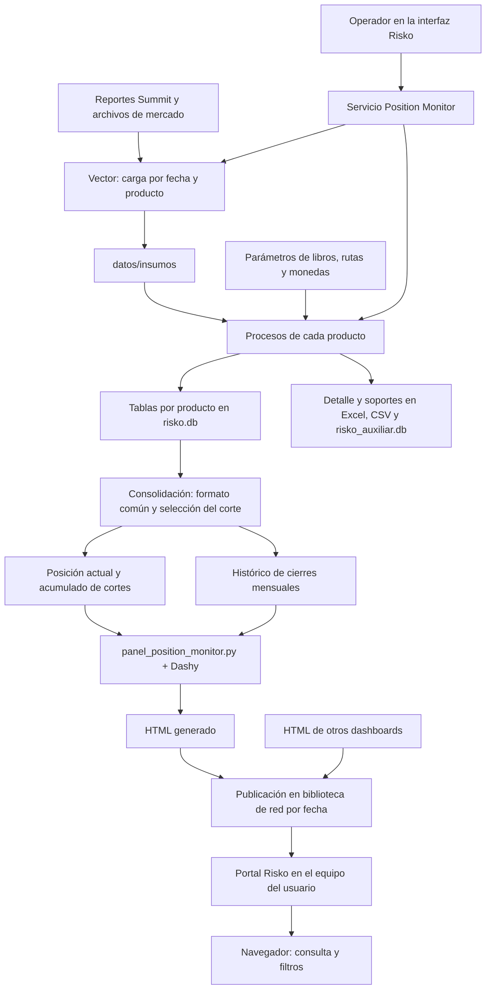

**Análisis del flujo actual de Risko antes de implementar el PyG**

Revisión del código disponible en `E:\BANCO\Risko`, realizada el 9 de septiembre de 2026. El objetivo es entender cómo se construye, conserva y publica la posición que el equipo ya validó. Este documento describe la implementación; no cambia los cálculos ni certifica nuevamente sus cifras.

Risko tiene dos aplicaciones con responsabilidades distintas. La **interfaz operativa** coordina la carga de insumos, los cálculos por producto, la consolidación y la generación/publicación del HTML. El **Portal Risko** permite al usuario encontrar y abrir los dashboards que se dejan en la biblioteca de red, incluidos HTML producidos por otras herramientas.



**Qué contiene cada carpeta**

| Carpeta o componente | Responsabilidad comprobada |
| --- | --- |
| `aplicaciones/interfaz_risko/` | Ventanas operativas, botones, consulta de tablas, filtros, exportaciones y log. |
| `aplicaciones/interfaz_risko/servicios/position_monitor.py` | Decide qué cargar, qué producto ejecutar, cuándo consolidar, cómo generar el tablero y dónde publicarlo. |
| `proyectos/position_monitor/procesos/` | Reglas de negocio de la posición, homologación de libros, consolidación y cálculo intradía. |
| `proyectos/position_monitor/configuracion/` | Flujos Vector y alcance del tablero; el código también espera aquí parámetros CSV y saldos iniciales. |
| `proyectos/position_monitor/tableros/` | Preparación de los datos visuales y construcción del HTML de posición. |
| `compartido/nucleo_risko/` | Rutas, calendario, lectura/escritura, SQLite, TRM y soportes auxiliares. |
| `portal/` | Catálogo de dashboards, apertura local, preferencias, instalación y actualización de la aplicación consumidora. |
| `proyectos/pyg/` | Trabajos previos de PyG de alcance desigual, que requieren revisión antes de reutilizarlos. |
| `tests/` | Pruebas existentes de productos, servicios, históricos, tableros y portal. |

Las carpetas operativas `datos/`, `Herramientas/` y `ejecuciones/` están definidas en el código, pero no están incluidas en esta copia local. Por ello se puede verificar cómo se invocan Vector y Dashy, aunque aquí no se puede inspeccionar su implementación interna ni ejecutar un cierre completo.

**Recorrido de un cierre desde la interfaz**

1. El operador selecciona una fecha. El calendario compartido contempla fines de semana y festivos de Colombia; los productos aplican reglas específicas para fechas no hábiles.
2. **Ejecutar cierre** llama a `ejecutar_todo_position_monitor()`. Primero solicita a Vector limpiar los archivos temporales de insumos.
3. El servicio procesa, en este orden: **Spot, Novados, Forward, Renta Fija, Opciones y Swaps**. Para cada uno carga los insumos necesarios y llama al motor correspondiente.
4. Cada motor devuelve una tabla con el formato común. También puede escribir soportes de cálculo y trazabilidad. El servicio guarda la tabla del producto en SQLite.
5. Durante la corrida completa se aplaza la consolidación hasta terminar los productos. Luego se consolida el corte y se construye el HTML.
6. El operador puede revisar la posición en la interfaz. **Publicar en portal** genera el HTML desde la posición actual y lo copia a la biblioteca de red.

El cierre completo termina con un HTML generado; la publicación de cierre es una acción adicional. Esto está separado en el código de la interfaz y en el servicio.

Fuentes: [interfaz principal](../aplicaciones/interfaz_risko/interfaz_risko.py), métodos `run_todo`, `run_consolidar`, `run_tablero` y `run_publicar_tablero`; [servicio](../aplicaciones/interfaz_risko/servicios/position_monitor.py), funciones `ejecutar_producto` y `ejecutar_todo_position_monitor`.

**Para qué sirve cada control operativo**

| Control | Efecto real |
| --- | --- |
| Ejecutar cierre | Limpia insumos, carga y calcula los seis productos, guarda sus tablas, consolida y genera el HTML. |
| Módulo individual | Carga el insumo del producto sin limpiar toda la carpeta, calcula y guarda su tabla. Por defecto también consolida su resultado si tiene filas. |
| Consolidar posición | Reúne las tablas procesadas disponibles para la fecha. No vuelve a calcular todos los productos. |
| Generar tablero | En el botón actual se pasa `consolidar=False`: construye el HTML con las tablas ya consolidadas. |
| Publicar en portal | Genera el HTML desde la base oficial actual y publica el archivo y sus metadatos. Bloquea la publicación desde la base de pruebas. |
| Ejecutar intradía | Calcula el preliminar en un entorno de datos separado y, desde este botón, también lo publica. |
| Limpiar insumos | Ejecuta el flujo Vector `00_Limpiar_Insumos`; su configuración elimina archivos por extensión en la carpeta de staging configurada. |
| Cargar / recalcular Spot acumulado | Importa saldos iniciales del Excel parametrizado y recalcula el acumulado posterior. |
| Probar Spot 2 · cierre | Ejecuta una variante de Spot Cliente en una base y carpeta de pruebas dedicadas. |
| Consulta, filtros y exportación | Permiten revisar tablas de SQLite y exportar la vista a CSV/Excel. El log deja visible la ejecución. |

Hay una diferencia entre API y botón: `generar_tablero()` tiene `consolidar=True` como valor por defecto, pero los botones actuales de generar/publicar lo desactivan explícitamente. La fecha elegida para publicar identifica la carpeta; no recalcula por sí sola ese corte. El código registra las fechas efectivas de los datos y muestra un aviso si no incluyen la solicitada.

**Vector y las fuentes de entrada**

Vector es el cargador de archivos que invoca el servicio mediante `Herramientas/VECTOR/VECTOR.py --cli`, con una fecha y un nombre de flujo. La configuración está en [risko.json](../proyectos/position_monitor/configuracion/risko.json). Su función dentro de esta arquitectura es dejar disponibles los archivos que esperan los motores.

| Producto | Insumos configurados para el cierre |
| --- | --- |
| Spot | `Cierre_ReporteCaja_{ddmmyy}_000.xls` e `Insumo tasas.xlsx`. |
| Novados | `Cierre_FutureTotalReport_{ddmmyy}_000.xls`. |
| Forward | `Cierre_Valoracion_FxFwd_{ddmmyyyy}_000.xls` y su versión IFRS. |
| Renta Fija | `ReporteTitulos_{ddmmyyyy}.csv`. |
| Opciones | `USR_OPT_MANANA_{next_bday_ddmmyy}_000.xls`, `ENTRADA2.xlsb` e `Insumo tasas.xlsx`. |
| Swaps | `Cierre_SwapTotalReport_Flujos_{ddmmyy}_000.xls` y su versión IFRS. |

Los reportes provienen de carpetas Summit de Caja, Future Total, valoración Forward, títulos, opciones y Swaps. `ENTRADA2.xlsb` viene de BDB. `Insumo tasas.xlsx` viene de Compliance de Tesorería. Opciones utiliza el reporte generado al siguiente día hábil para el corte solicitado.

El servicio usa Vector en la ruta ordinaria. Existen excepciones implementadas: en fechas no hábiles Forward y Renta Fija tienen funciones específicas para preparar sus fuentes; Spot y Novados usan arrastre. Por eso la regla general de carga debe leerse junto con esas ramas del servicio.

La configuración Vector conserva rutas UNC productivas, mientras varias rutas Python se derivan de la ubicación del proyecto. Ejecutar esta copia en `E:` no configura automáticamente un entorno aislado con esas mismas fuentes y destinos.

**Cómo se construye la posición de cada producto**

Las reglas siguientes describen lo implementado. `POSICION` tiene una interpretación propia en cada motor antes de entrar al formato común.

| Producto | Cálculo y reglas principales | Detalle que importa para el futuro PyG |
| --- | --- | --- |
| **Spot** | Acumula `posición anterior + compras USD − ventas USD`. Lee los movimientos de Caja en USD, filtra owners y libros parametrizados y mantiene saldos iniciales y arrastres. Usa `Decimal` para el acumulado. `SPOT_CLIENTE` toma `TRADE DATE`; los demás libros toman `ValueDate`. Hay una excepción explícita de colaterales DP para `DPMT_TR`, `FWD_CLIENTES`, eventos `FEE/INT` y USD. | Movimientos, saldo inicial, fechas, compras/ventas, alertas y auditoría. Reprocesar una fecha puede recalcular los saldos posteriores. Sin saldo anterior puede continuar desde cero dejando alerta. |
| **Novados** | Por operación, si el vencimiento coincide con el corte la posición es cero; en los otros casos toma `VALOR_SENSIBLE`. Agrega por BOOK. En fechas no hábiles el servicio copia la última posición anterior al corte solicitado. | El consolidado no conserva los campos de MTM ni todos los identificadores del reporte original; varios se descartan durante la depuración de posición. |
| **Forward** | Antes del vencimiento, cuando alguna pata es COP toma el VP USD de compra o venta según el sentido. Si ninguna pata es COP suma ambos VP USD. Al vencer, deja cero si liquida en COP o ya alcanzó cumplimiento; en el otro caso toma el VP en moneda de liquidación. Calcula Banking e IFRS por separado y obtiene `CVA/DVA = IFRS − Banking`. | Se necesitan las operaciones y valoraciones originales para explicar cambios entre cortes; la tabla agregada por BOOK pierde ese detalle. |
| **Renta Fija** | Toma `VP MDO Y CCY`, en la moneda del título, y agrega por dimensiones de posición. El alcance implementado habilita COP, USD, EUR y UVR. También calcula duración y sensibilidades en los soportes. | La moneda nativa debe conservarse. El nombre genérico POSICION no significa que todos los títulos ya estén expresados en USD o COP. |
| **Opciones** | Carga curvas COP/USD, superficie de volatilidad y TRM. Para vigentes calcula sensibilidad spot por diferencias centradas de valoraciones, `dV_COP/dSpot`, expresada en USD. El delta por nominal se conserva como soporte. Para vencidas aplica reglas de cumplimiento y moneda de liquidación. | La salida consolidable agrupa todo en `BOOK='Opciones'`. El detalle por operación, por BOOK y las curvas/superficie quedan en soportes. El cierre de posición publica solo Banking para este producto. |
| **Swaps** | Por flujo deja cero si `DATE < corte` o si la moneda en riesgo es COP; en otro caso toma `VP MONEDA EN RIESGO`. Agrega por BOOK, procesa Banking/IFRS y calcula su diferencia CVA/DVA. En la salida de cierre agrupa los libros Trading bajo `Swaps`, conservando los libros bancarios según parámetros. | Para resultados por libro original o por operación se requiere el detalle anterior a esa agrupación. |

Fuentes directas: [Spot](../proyectos/position_monitor/procesos/spot.py), `_leer_movimientos` y `_recalcular_posicion`; [Novados](../proyectos/position_monitor/procesos/novados.py), `_depurar_novados`; [Forward](../proyectos/position_monitor/procesos/forward.py), `_depurar_forward_posicion`; [Renta Fija](../proyectos/position_monitor/procesos/renta_fija.py), `_construir_tabla_canonica`; [Opciones](../proyectos/position_monitor/procesos/opciones.py), `_calcular_detalle_opciones` y `_construir_tabla_posicion`; [Swaps](../proyectos/position_monitor/procesos/swaps.py), `_calcular_posicion_usd` y `_consolidar_tabla_swaps_publicacion`.

**Homologación y contrato de consolidación**

El formato común tiene diez columnas:

```text
FECHA · PRODUCTO · BOOK · POSICION · MONEDA_POSICION
LB_LT · INSTRUMENTO · COMPANY · CLASIFICACION_CONTABLE · BANKING_CVA_DVA
```

`parametros_libros.py` consulta `param_libros.csv` para homologar BOOK y asignar LB/LT, instrumento y moneda en los productos que utilizan ese enriquecimiento. También reconoce nombres homologados y detecta definiciones incompatibles. La ausencia de un mapeo puede dejar `LB_LT='No definido'` con alerta; Spot tiene además controles de activación del libro. Renta Fija complementa esta parametrización con sus tablas propias.

Estas columnas describen dimensiones distintas: `LB_LT` distingue clasificación del libro, mientras `BANKING_CVA_DVA` identifica la vista de valoración. No deben mezclarse al diseñar filtros o sumas del PyG.

La consolidación homologa nombres, fechas y tipos numéricos. **No revalora los productos ni convierte globalmente todas las posiciones a una moneda común.** Conserva las vistas Banking y CVA/DVA, y excluye IFRS de las tablas consolidadas publicables. IFRS puede permanecer en las tablas de producto y sus soportes.

Cubrebonos, NDFTES y PP tienen archivos de código, pero están fuera de la corrida diaria, de los botones de producto habilitados y de la entrada nueva al consolidado. Spot 2 también permanece fuera del cierre e intradía según los interruptores de `risko.json`; la lógica reciente de Spot Cliente en el motor principal debe distinguirse de esa variante de pruebas.

Fuente: [consolidacion.py](../proyectos/position_monitor/procesos/consolidacion.py), `COLUMNAS_POSICION`, `VISTAS_PUBLICABLES`, `consolidar_position_monitor`; [parametros_libros.py](../proyectos/position_monitor/procesos/parametros_libros.py).

**Dónde queda guardada la información**

| Almacenamiento | Papel en el flujo |
| --- | --- |
| `risko.db`, tablas `tbl_posicion_*` por producto | Resultados de producto que consume la consolidación. |
| `tbl_posicion_consolidada` | Acumulado de cortes procesados. Al reprocesar se sustituyen las combinaciones de producto y fecha afectadas. |
| `tbl_posicion_actual` | Posición del corte seleccionado. Sin fecha explícita, la selección interna toma el último corte disponible por producto. |
| `tbl_posicion_historico` | Subconjunto de cierres del **último día calendario del mes**, incluso si cae en día no hábil. |
| `risko_auxiliar.db` | Copias consultables de detalles, tablas intermedias, curvas y controles. Incluye catálogo, fecha de corte, módulo y momento de carga. |
| `risko_pruebas.db` | Alternativa de las tablas oficiales cuando se usa el modo de pruebas. Esto no implica que todos los archivos intermedios o las cargas Vector estén redirigidos. |
| `risko_intradia.db` | Base separada utilizada para calcular Spot intradía a partir de un clon de la oficial. |
| CSV/Excel en procesados/publicados | Soportes operativos y compatibilidad. Hay rutas de respaldo que recuperan archivos cuando no existe información SQLite utilizable. |

La base auxiliar es especialmente relevante para el PyG por su nivel de detalle. Su escritura maneja errores sin detener necesariamente el cálculo principal: antes de convertirla en insumo obligatorio hay que comprobar la completitud efectiva por fecha.

La corrida escribe productos y tablas consolidadas en pasos separados. Una ejecución fallida puede dejar resultados parciales persistidos. La posibilidad de reprocesar por producto/fecha y los registros de ejecución son parte del funcionamiento actual.

Fuentes: [consolidación](../proyectos/position_monitor/procesos/consolidacion.py), `_fusionar_historico`, `_es_fin_mes_operativo`, `_seleccionar_actual_desde_tabla`; [base_datos.py](../compartido/nucleo_risko/base_datos.py); [tablas_auxiliares.py](../compartido/nucleo_risko/tablas_auxiliares.py).

**Intradía**

El intradía tiene una ruta explícita de insumos, procesamiento y HTML. Selecciona archivos por el mayor sufijo numérico válido y aplica controles de tamaño. Calcula **Forward, Novados, Opciones, Swaps y Spot**; Renta Fija no aparece en la lista del motor intradía de esta copia.

El preliminar admite solo Banking. Opciones y la escala COP/USD del tablero utilizan el promedio SETFX del corte; esa ruta no toma TRM FORMADA. Novados ajusta las operaciones negociadas en el día con nominal firmado. Spot usa un clon de la base oficial como ancla para su acumulación.

El botón intradía publica directamente después del cálculo. Aunque los datos de cálculo están separados, **cierre e intradía de una misma fecha comparten el destino publicado** `portfolio_position_monitor.html`. La última publicación reemplaza la anterior. `publicacion.json` identifica el tipo de corte y sus fuentes.

Fuentes: [intradia.py](../proyectos/position_monitor/procesos/intradia.py), `PRODUCTOS_INTRADIA` y `calcular_position_monitor_intradia`; [servicio](../aplicaciones/interfaz_risko/servicios/position_monitor.py), `ejecutar_intradia_position_monitor` y `publicar_tablero`.

**Dashy, publicación y Portal Risko**

`panel_position_monitor.py` lee posición actual e histórico, aplica el alcance definido en `dashboard_publicacion.json` y entrega datasets, filtros y tarjetas a `dashy.DashboardBuilder`. La TRM FORMADA exacta del corte se usa para la escala del tablero de cierre. Esta preparación visual no modifica la moneda nativa almacenada en las filas.

La biblioteca de producción usa esta estructura:

```text
Portal Riesgos de Mercado/
  Dashboards/
    Portfolio Position Monitor/
      dashboard.json
      AAAA-MM-DD/
        portfolio_position_monitor.html
        publicacion.json
```

`dashboard.json` identifica el tablero y habilita su integración con configuraciones del portal. `publicacion.json` registra fecha solicitada, fechas efectivas de datos, fecha/hora de publicación, usuario, origen, tamaño, SHA-256 y tipo de corte. El HTML y los manifiestos se escriben con archivos temporales y reemplazo por archivo.

El consumidor utiliza `portal/script.py`, una aplicación local que recorre la biblioteca de HTML/HTM y construye el catálogo. Reconoce los manifiestos cuando existen y admite dashboards simples sin ellos, usando su carpeta, nombre y metadatos disponibles. Así encajan los dashboards externos que describes: pueden publicarse en la misma biblioteca sin compartir el motor de posición.

Al abrir un dashboard, el portal lo sirve en `127.0.0.1` con un puerto local dinámico y lo presenta en el navegador. Para tableros que habilitan esa integración, añade controles de vistas/filtros. Las preferencias y favoritos se guardan localmente por usuario; los comentarios diarios se leen desde el contenido publicado. El portal no necesita ejecutar los motores de posición ni Dashy para consultar los resultados.

La distribución de la aplicación es otro flujo: `publicar_portal.ps1` compila y publica versiones bajo `Sistema Portal/Versiones`, junto con manifiestos e instalador. `launcher.py` consulta la versión publicada y mantiene una copia local validada mediante hash. Actualizar la aplicación del portal y publicar un nuevo HTML son operaciones independientes.

Fuentes: [tablero](../proyectos/position_monitor/tableros/panel_position_monitor.py), `load_dashboard_tables` y `build_dashboard`; [servicio de publicación](../aplicaciones/interfaz_risko/servicios/position_monitor.py), `publicar_tablero`; [portal](../portal/script.py), `_scan_dashboards`, `_dashboard_definition`, `PortalDashboardServer`; [launcher](../portal/launcher.py), `_cache_release`; [publicación de la aplicación](../portal/publicar_portal.ps1).

**Qué implica este flujo para el PyG**

La estructura ya proporciona interfaces, carga de archivos por fecha, utilidades de datos, parametrización, soportes, generación de HTML y distribución al usuario. Esos componentes ofrecen puntos de reutilización para un proyecto PyG separado.

La posición agregada sirve como control de exposición, pero no contiene por sí sola todo lo necesario para explicar el resultado. Por ejemplo, Opciones colapsa los libros en una fila, Swaps reúne los libros Trading y Novados descarta campos de MTM al preparar la posición. La especificación del PyG debe identificar qué información debe tomarse antes de esas transformaciones.

Antes de programar el cálculo corresponde definir, con el proceso de PyG de referencia:

- Los productos y libros incluidos y la periodicidad: resultado diario, acumulado mensual u otra ventana.
- La definición de cada componente y su fuente de conciliación.
- Las valoraciones y datos de mercado de ambos cortes y el nivel de detalle por operación que debe conservarse.
- El tratamiento de operaciones nuevas, vencimientos, cumplimientos, flujos y ajustes.
- Las reglas de moneda, fechas no hábiles, Banking/IFRS/CVA-DVA y agrupación por libro.
- La persistencia de resultados, la evidencia de conciliación y las condiciones para publicar un corte.

Estas son definiciones pendientes del nuevo PyG; no se deducen automáticamente de las reglas de posición ni se proponen aquí fórmulas de resultado.

**Archivos previos de PyG encontrados**

En esta copia sí existen `interfaz_pyg.py`, `servicios/pyg.py`, procesos, tableros, configuraciones y pruebas de PyG. La interfaz principal incluso tiene un botón **Abrir PyG** que abre otra ventana. Esto demuestra trabajo previo, pero no que exista un PyG operativo y validado para el alcance que vamos a construir.

La revisión encontró tres situaciones distintas:

- Opciones tiene un motor de revaloración entre snapshots con escenarios y controles.
- El consolidado mensual asociado al libro de Opciones lee las hojas `GRIEGAS OPC` y `RESUMEN FINAL` de una referencia Excel; las posiciones de Risko se usan como control. Esa ruta no equivale a reconstruir todo el resultado desde operaciones primarias.
- La ruta actual `calcular_pyg_book_fx_strat()` invoca los módulos con fecha y libro. Forward y Swaps contienen importes predeterminados, y Caja también tiene valores por defecto. Por tanto, esa llamada no demuestra un cálculo variable por fecha alimentado con los insumos cargados.

Conviene conservar estos archivos como antecedentes y evaluar cada parte antes de reutilizarla. Las evidencias JSON guardadas y las afirmaciones de los README no sustituyen la reproducción del cálculo con datos y referencias del alcance acordado.

Fuentes: [consolidación PyG](../proyectos/pyg/procesos/consolidacion.py), `calcular_pyg_book_fx_strat` y `calcular_pyg_consolidado`; [Forward PyG](../proyectos/pyg/procesos/forward.py); [Swaps PyG](../proyectos/pyg/procesos/swaps.py); [Caja PyG](../proyectos/pyg/procesos/caja.py); [referencia mensual](../proyectos/pyg/procesos/referencia_mensual.py); [Opciones PyG](../proyectos/pyg/procesos/opciones.py).

**Diferencias entre documentación y código que hay que tener presentes**

| Tema | Implementación revisada |
| --- | --- |
| Histórico mensual | Último día calendario. Algunos documentos y el aviso de históricos de la interfaz aún hablan del último hábil. |
| Generar tablero | El botón no reconsolida; la función admite hacerlo cuando se invoca con ese argumento. |
| Renta Fija | La posición toma `VP MDO Y CCY`; las menciones anteriores a valores COP no describen la salida actual. |
| Spot sin DP | Existe una excepción específica para colaterales DP, además de la regla especial de fecha para Spot Cliente. |
| Preferencias del portal | La configuración actual se guarda localmente; subsisten referencias antiguas a configuraciones en red. |
| PyG terminado | Existen componentes y prototipos con distintas fuentes; la presencia de archivos o botones no acredita un motor integral validado. |

**Alcance de la verificación**

Se contrastaron la interfaz, los servicios, los procesos, las configuraciones incluidas, la infraestructura compartida, el tablero, el portal y las pruebas relevantes. Se analizaron sintácticamente los **71 archivos Python** disponibles mediante `ast.parse`, sin errores y sin ejecutar los módulos.

No se lanzó la interfaz ni se ejecutaron cálculos o publicaciones. En esta copia faltan las bases, los insumos, Vector, Dashy y parámetros como `param_libros.csv`, `param_rutas.csv`, `param_librorf.csv` y `param_monedarf.csv`. El Python disponible tampoco tiene `holidays`, `pytest` ni `customtkinter`. Por ello la verificación es estructural; no reproduce cifras ni confirma qué versión o parámetros están desplegados en la red.

El resultado de esta revisión es un mapa del circuito que debemos preservar: **fuentes → cálculo por producto → detalle y posición consolidada → HTML publicado → consulta en el portal**. El próximo trabajo funcional del PyG deberá conectar sus cálculos y controles a ese circuito con una definición explícita de insumos, componentes y conciliación.
