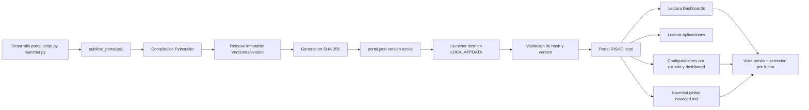

# Documentacion Local - Portal RISKO

## 1. Objetivo del portal

Portal RISKO es una aplicacion de escritorio que centraliza el acceso a:

- Dashboards HTML publicados en la biblioteca productiva.
- Aplicaciones ejecutables disponibles para usuarios de Riesgo.
- Comentarios diarios y novedades globales.
- Configuraciones por usuario y por dashboard.

La aplicacion no recalcula riesgos. Su funcion es consumir publicaciones ya generadas y ofrecer una experiencia consistente de consulta.

---

## 2. Como esta construido

### 2.1 Componentes principales

1. Aplicacion principal (UI y logica)
   - Archivo: script.py
   - Tecnologia: Python + Tkinter
   - Responsabilidades:
     - Descubrir dashboards y aplicaciones.
     - Agrupar versiones por dashboard.
     - Mostrar vista previa y metadatos.
     - Gestionar fecha/posicion y seleccion de recursos.
     - Leer novedades globales y comentarios diarios.

2. Puente HTTP local
   - Implementado dentro de script.py (servidor localhost 127.0.0.1)
   - Responsabilidades:
     - Servir dashboards para vista previa.
     - Exponer endpoints locales de configuraciones.
     - Inyectar herramientas de guardado/restauracion cuando un dashboard lo permite.

3. Launcher local
   - Archivo: launcher.py
   - Responsabilidades:
     - Leer el manifiesto de version activa (portal.json).
     - Validar hash SHA-256 de la version objetivo.
     - Copiar/versionar binarios en LOCALAPPDATA.
     - Abrir Portal RISKO localmente.

4. Instalador autocontenido
   - Archivo: instalador_launcher.py
   - Responsabilidades:
     - Instalar launcher local por unica vez.
     - Crear accesos directos locales.
     - Verificar integridad del paquete del launcher.

5. Publicador de versiones
   - Archivo: publicar_portal.ps1
   - Responsabilidades:
     - Compilar ejecutables (PyInstaller).
     - Publicar release inmutable en Versiones/<version>.
     - Generar release.json con metadatos y hash.
     - Activar version via portal.json.

---

## 3. Rutas y convenciones de operacion

### 3.1 Biblioteca productiva

Ruta raiz productiva:

- \\ISILONSMBPROD\Gerencia_Riesgo_De_Tesoreria\Portal Riesgos de Mercado

Subcarpetas clave:

- Dashboards
- Aplicaciones
- Comentarios diarios
- Sistema Portal
  - portal.json (version activa)
  - Instalador
  - Versiones
  - Legado

### 3.2 Configuracion local por usuario

Se guarda en LOCALAPPDATA, no en red, para resiliencia y mejor experiencia.

### 3.3 Novedades

Novedades es global y se toma de:

- Comentarios diarios/Novedades/novedad.md

### 3.4 Ultima publicacion

Se calcula por dashboard seleccionado tomando el archivo HTML mas reciente por fecha de modificacion de archivo.

---

## 4. Flujo funcional (ejecucion de usuario)

1. Usuario abre el acceso directo Portal RISKO.
2. Launcher local consulta portal.json en Sistema Portal.
3. Si hay version nueva, la descarga/copia local y valida hash.
4. Abre el ejecutable local del portal.
5. Portal escanea Dashboards y Aplicaciones publicadas.
6. Portal agrupa versiones por dashboard y selecciona la posicion vigente.
7. Portal muestra:
   - Vista previa.
   - Ultima publicacion por dashboard seleccionado.
   - Configuraciones por dashboard.
   - Novedades globales.

---

## 5. Flujo de publicacion de una version del portal

1. Se ejecuta publicar_portal.ps1 con version nueva (inmutable).
2. Se compila PortalRisko (y opcionalmente Launcher/Instalador).
3. Se publica release en Sistema Portal/Versiones/<version>.
4. Se calcula y registra SHA-256 de ejecutable.
5. Se actualiza portal.json para activar la nueva version.
6. Usuarios reciben la nueva version en el siguiente inicio via launcher.

---

## 6. Controles de integridad y seguridad

- Versionado inmutable por carpeta de release.
- Verificacion SHA-256 para ejecutables.
- Activacion controlada por manifiesto portal.json.
- Ejecucion local (reduce dependencia de abrir binarios en red).
- Persistencia local de configuraciones por usuario.
- Puente tecnico restringido a localhost.

---

## 7. Diagrama del flujo de construccion y operacion

---

## 8. Checklist operativo rapido

Antes de publicar:

- Confirmar version nueva no existente.
- Validar self-test del portal.
- Validar logs y comportamiento de vista previa.

Despues de publicar:

- Verificar portal.json activo.
- Verificar release.json de la version.
- Confirmar SHA-256 del ejecutable.
- Abrir portal desde acceso directo local y validar carga.

---

## 9. Referencias internas

- script.py
- launcher.py
- instalador_launcher.py
- publicar_portal.ps1
- README.md
- Documentacion/ARQUITECTURA_RISKO_PORTAL.md
